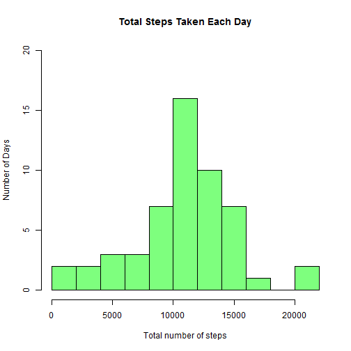
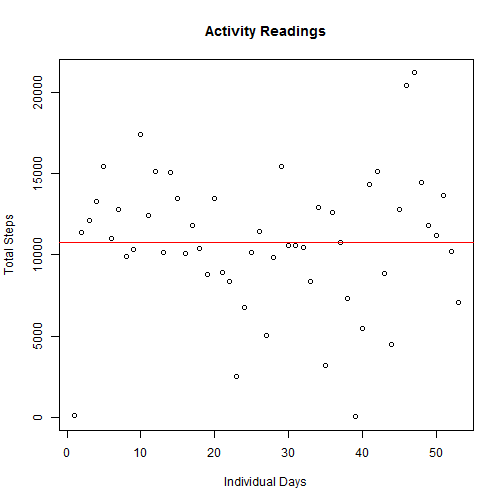
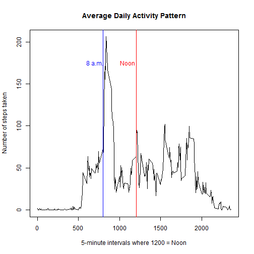
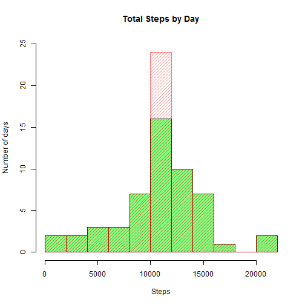
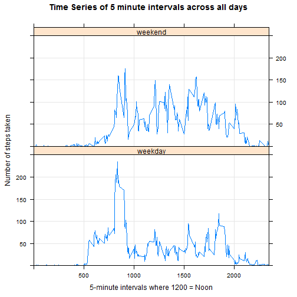

PA1_template.Rmd

### Load and process the data
1. Load the activity data from the directory which stores it  
2. Process/transform the data (if necessary)  
    a) I ensured the dates were in date format for later manipulation

```r
file_name <-  
 "C://Users/banderson/Desktop/Coursera/C05.Reproducible_Research/activity.csv"
activity_file <- read.csv(file_name, header=TRUE, sep=",",
                    stringsAsFactors=FALSE,na.strings="NA" )
activity_file[,2] <- as.Date(activity_file[,2])
```

### What is mean total number of steps taken per day?
**Ignore the missing values in the dataset, unless needed**  
1. Make a histogram of the total number of steps taken each day  
    a) In this section, all rows with "NA" for the number of steps were removed  
    b) There are only 61 days in the original data, 53 of which have readings  
2. Calculate and report the **mean** and **median** total steps per day  
    a) Mean and median are quite close in this dataset  


```r
activity_not_NA <- subset(activity_file,!is.na(steps))
date_agg <- aggregate(steps ~ date, activity_not_NA, sum)
hist(date_agg$steps, breaks=10, col=rgb(0,1,0,.5), ylim=c(0,20),
     xlab="Total number of steps", ylab="Number of Days",
     main="Total Steps Taken Each Day")
```

 


```r
mean_steps   <- as.integer(round(mean(date_agg$steps)))
median_steps <- as.integer(median(date_agg$steps))
```

**The mean is 10766 steps and the median is 10765 steps.**  


I added a plot of steps take on a day-by-day basis to show the scatter around the mean.


```r
plot(date_agg$steps, xlab="Individual Days", ylab="Total Steps",
     main="Activity Readings")
abline(a=mean_steps, b=0, col="red")
```

 


### What is the average daily activity pattern?

1. Make a time series plot of the 5-minute interval (x-axis) and the  
    average # of steps taken, averaged across all days (y-axix)
2. Which 5-minute interval, on average across all the days in the dataset,  
    contains the maximum number of steps?

```r
interval_agg <- aggregate(steps ~ interval, activity_not_NA, mean)
plot(interval_agg$interval, interval_agg$steps,
     type = "l", xlab="5-minute intervals where 1200 = Noon",
     ylab="Number of steps taken",main="Average Daily Activity Pattern")
abline(v=800, col="blue")
abline(v=1200, col="red")
text(700, 175, "8 a.m.", col="blue")
text(1100, 175, "Noon", col="red")
```

 

```r
max_steps    <- max(interval_agg$steps)
max_interval <- interval_agg[which.max(interval_agg$steps),1]
```

**It appears that the most average steps (206.1698) are taken in 
    the 835 time interval.**  

### Imputing missing values
1. Calculate and report the total # of missing values in the dataset  
2. Devise a strategy for filling in all of the missing values  
    a) **I chose to inpute using the mean of each daily interal**  
3. Create a new dataset that is equal to the original but with NAs filled in  
4. Make a histogram of the total number of steps taken each day and caculate  
    and report the **mean** and **median** # of steps taken each day. Do  
    these values differ from the estimates in the first part of the project?  
    What is the impact of imputing missing data on the estimates of the total  
    daily number of steps?  

```r
missing_values <- sum(is.na(activity_file$steps))
```
**The number of missing values is 2304, which is exactly 8 days.**  


```r
mean_by_interval <- as.data.frame(tapply(X = activity_file$steps, 
        INDEX = list(activity_file$interval), FUN = mean, na.rm=TRUE))
names(mean_by_interval) <- "steps"
mean_by_interval <- cbind(interval = as.integer(rownames(mean_by_interval))
                          , mean_by_interval)
new_activity_file <- activity_file

for(i in 1:nrow(new_activity_file)){
    if (is.na(new_activity_file[i,1])){
        new_activity_file[i,1] <-
           mean_by_interval[mean_by_interval$interval==new_activity_file[i,3],2]
        } 
    }
new_date_agg <- aggregate(steps ~ date, new_activity_file, sum)

hist(date_agg$steps, breaks=10, col=rgb(0,1,0,.5), ylim=c(0,25),
     xlab="Steps",ylab="Number of days",main="Total Steps by Day")
hist(new_date_agg$steps, breaks=10, col=rgb(1,0,0,.5), density=c(20),add=TRUE)
```

 

```r
mean_steps_new   <- as.integer(round(mean(new_date_agg$steps)))
median_steps_new <- as.integer(median(new_date_agg$steps))
```

**The new mean number of steps is 10766 and the new median is 
10766 steps per day.**  

You can see in the histogram the original data (in green) and graphed on top  
of it (in red hash) the data with the imputed values. The only change is eight  
mean values added to the bar in the "middle" of the plot.

The mean has stayed the same as in the original dataset, and the median has  
dropped to equal the mean. The change in the median is an unsurprising result,  
since the imputed values covered 8 entire days (i.e. where there was at least  
one "NA" in the original dataset *all* values for that day were also "NA").  
That means the only imputed data was *exactly* at the mean. The mean would not  
be expected to change, and median could only be drawn closer to the mean.

### Differences in activity patterns between weekdays and weekends

1. Create a new factor variable with two levels - "weekday" and "weekend."
    a) First had to translate to "day of the week", and then refactor
2. Make a panel plot containing a time series plot of the 5-minute interval  
    (x-axis) and the avg. # of steps taken, averaged across all weekday days  
    or weekend days (y-axis).


```r
activity_not_NA$weekday <- weekdays(activity_not_NA[,2])
new_activity_not_NA     <- activity_not_NA

for(i in 1:nrow(new_activity_not_NA)){
    if (new_activity_not_NA[i,4] %in% c("Saturday","Sunday")){
        new_activity_not_NA[i,4] <- "weekend"
        } else {
        new_activity_not_NA[i,4] <- "weekday"
        }
    }

library(lattice)
weekday_agg <- aggregate(steps ~ weekday + interval, new_activity_not_NA, mean)

xyplot(weekday_agg$steps ~ weekday_agg$interval | weekday_agg$weekday
       , type="l", grid = TRUE
       , ylim=c(0,250), xlim=c(0,2350)
       , layout=c(1,2)
       , xlab="5-minute intervals where 1200 = Noon", ylab="Number of steps taken"
       , main="Time Series of 5 minute intervals across all days"
        )
```

 
